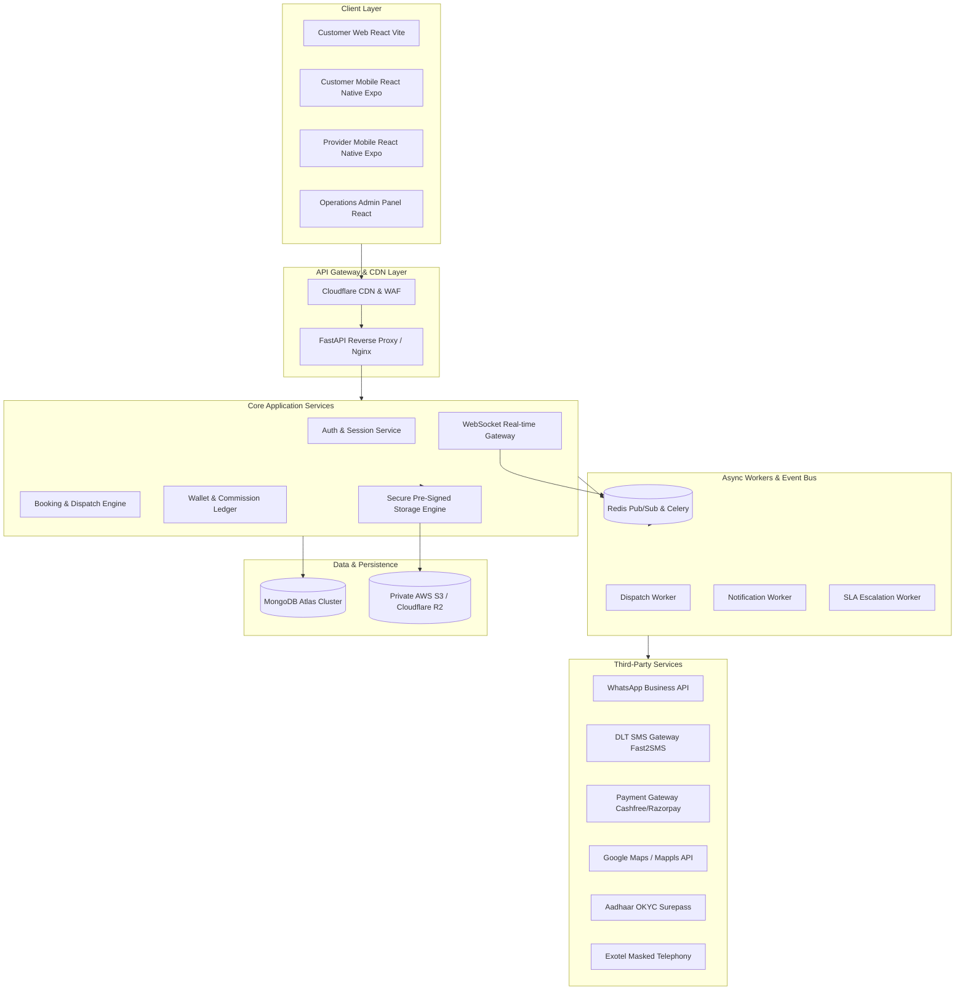
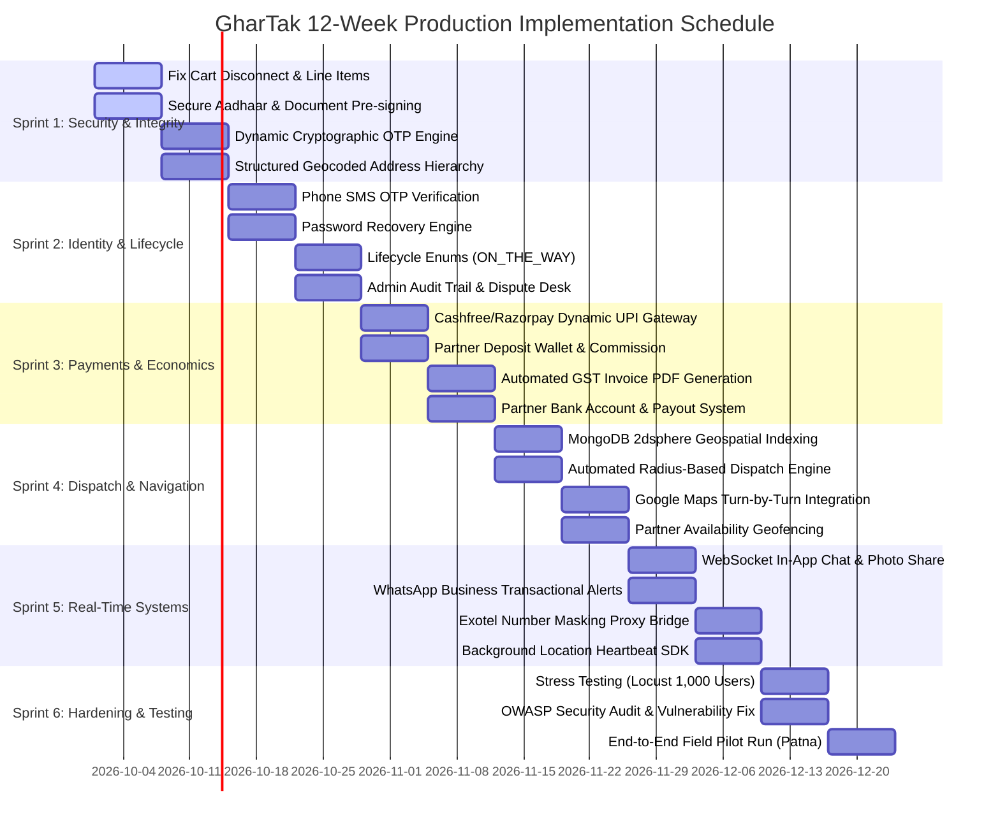

# GharTak: Comprehensive Implementation Roadmap, Technical Architecture & Cost Estimation

**Target Audience:** Platform Owners, Executive Stakeholders & Prospective Investors  
**Subject:** Full-Scale Production Roadmap & Cost of Ownership (Phase 7 MVP → Enterprise Hyperlocal Marketplace)  
**Author:** Senior Systems Architect & Marketplace Operations Lead  
**Date:** September 2026  
**Currency Standard:** Indian Rupee (INR ₹) & US Dollar (USD $, benchmarked at ₹84.00 / USD)

---

## Executive Summary

The initial build of GharTak establishes fundamental entity models, localized branding, and scaffolding for a Patna-focused home services platform. However, to operate as a commercially viable, secure, and legally compliant marketplace competing with platforms like Urban Company, the platform requires essential infrastructure upgrades across:
1. **Automated Geospatial Dispatch & Location Intelligence**
2. **In-App Encrypted Communications & Telephony Number Masking**
3. **Multi-Channel Notification Infrastructure (WhatsApp, SMS, Push)**
4. **Partner Economics (Prepaid Deposit Wallets, Automated Commission Split, UPI Escrow)**
5. **Government-Grade KYC & Fraud Prevention (DigiLocker/UIDAI OKYC, Facial Liveness)**

This document provides a realistic, granular budget, technical architecture breakdown, and implementation plan spanning **12 to 14 weeks**, outlining both one-time development costs and recurring operating expenditures across three operational stages (Pilot, Growth, Scale).

---

## 1. Technical Architecture Target State

To transition from the current monolithic prototype into a fault-tolerant, event-driven marketplace, the following target architecture will be deployed:



---

## 2. Third-Party Subscriptions & API Services Breakdown

A production marketplace cannot build mapping algorithms, cellular towers, or banking networks in-house. It orchestrates battle-tested third-party APIs. Below is the comprehensive vendor evaluation matrix tailored for the Indian regulatory and geographic landscape.

### A. Core External Services & Recommended Vendors

| Domain | Recommended Vendor | Alternative Vendors | Why Needed | Regulatory / Technical Requirement |
| :--- | :--- | :--- | :--- | :--- |
| **Identity & KYC** | **Surepass.io** | Cashfree Verification, HyperVerge | Instant Aadhaar & PAN verification without manual admin review | Complies with UIDAI guidelines & DPDP Act 2023. Pulls verified name & photo directly. |
| **SMS Gateway** | **Fast2SMS / Gupshup** | Textlocal, MSG91 | 4-digit registration OTP, emergency booking fallbacks | TRAI / DLT (Distributed Ledger Technology) Entity & Header registration required in India. |
| **WhatsApp Business** | **Meta Cloud API (via AISensy / Wati)** | Twilio WABA, Interakt | Instant booking updates, OTP, arrival notifications, invoice PDF delivery | 98% open rate in Patna vs. 15% email open rate; primary customer trust channel. |
| **Mapping & Geocoding** | **Google Maps Platform** *(or Mappls / MapmyIndia for cost savings)* | Mapbox, Radar | Street autocomplete, precise lat/long coordinates, turn-by-turn routing | Mandatory for locating residences in unorganized tier-2 urban lanes. |
| **Telephony Masking** | **Exotel / Knowlarity** | Twilio India, Tata Tele | Masked proxy call bridging between customer and technician | Prevents platform disintermediation and protects customer phone privacy. |
| **Payments & Escrow** | **Cashfree Payments** | Razorpay, PayU | Cashless checkout, Instant UPI QR generation, automated partner payouts | Auto-splits platform commission; supports instant T+0 bank account transfers via IMPS. |
| **Object Storage** | **Cloudflare R2** *(or AWS S3)* | DigitalOcean Spaces | Secure, encrypted storage for Aadhaar, certifications, job photos | **Zero egress fees** on Cloudflare R2; pre-signed URLs expire after 3 minutes. |
| **Push Notifications** | **Firebase Cloud Messaging (FCM) + Expo** | OneSignal | Background and foreground mobile app push alerts | Essential for technicians on mobile devices with locked screens. |
| **Error Monitoring** | **Sentry** | Datadog, LogRocket | Real-time crash monitoring for React, React Native, and FastAPI | Prevents silent failures in production booking and payment flows. |

---

## 3. Recurring Operational Cost Estimates (OpEx)

Costs are projected across three distinct operational phases:
* **Stage 1 (Pilot Launch):** 0 to 1,000 completed bookings/month (Patna Pilot, 50 active partners).
* **Stage 2 (Growth Stage):** 1,000 to 10,000 completed bookings/month (Patna Full Coverage, 250 active partners).
* **Stage 3 (Scale & Expansion):** 10,000 to 50,000 completed bookings/month (Bihar Regional, 1,000+ active partners).

### Monthly Recurring Cost Matrix

```
STAGE 1 (Pilot: ~1,000 bookings/mo)   ===>  ₹19,200 / month  (~ $228 USD)
STAGE 2 (Growth: ~10,000 bookings/mo) ===>  ₹74,500 / month  (~ $886 USD)
STAGE 3 (Scale: ~50,000 bookings/mo)  ===>  ₹2,68,000 / month (~ $3,190 USD)
```

#### Detailed Itemization Table (Monthly Figures)

| Operational Service | Unit Cost Benchmark | Stage 1: Pilot (1,000 jobs/mo) | Stage 2: Growth (10,000 jobs/mo) | Stage 3: Scale (50,000 jobs/mo) |
| :--- | :--- | :--- | :--- | :--- |
| **Cloud Hosting (Compute)** | Render / AWS EC2 (FastAPI + Workers) | ₹2,500 ($30) | ₹7,000 ($83) | ₹25,000 ($298) |
| **Managed Database** | MongoDB Atlas Cluster (M10 → M30) | ₹3,500 ($42) | ₹8,500 ($101) | ₹22,000 ($262) |
| **Redis Cache & Queues** | Upstash / Redis Cloud | ₹0 (Free tier) | ₹1,500 ($18) | ₹6,000 ($71) |
| **Secure Storage (R2 / S3)** | Cloudflare R2 (100GB to 2TB) | ₹500 ($6) | ₹1,500 ($18) | ₹5,000 ($60) |
| **Transactional SMS (DLT)** | ₹0.18 per SMS (2 SMS/booking) | ₹400 ($5) | ₹4,000 ($48) | ₹20,000 ($238) |
| **WhatsApp Business API** | ₹0.40 per marketing/auth utility msg | ₹1,200 ($14) | ₹9,000 ($107) | ₹45,000 ($536) |
| **Maps & Geocoding** | Google Maps ($200 monthly free credit) | ₹0 (Within free tier) | ₹8,000 ($95) | ₹35,000 ($417) |
| **Telephony Masking** | Exotel ₹1.00/minute call bridging | ₹1,500 ($18) | ₹12,000 ($143) | ₹45,000 ($536) |
| **Partner KYC Verification** | Surepass ₹15.00 per completed KYC | ₹1,500 (100 new pros) | ₹3,000 (200 new pros) | ₹7,500 (500 new pros) |
| **Payment Gateway Fees** | 1.8% per online transaction (absorbed/customer) | ₹0 (Cash on Service) | ₹18,000 *(Gross transaction fee)* | ₹50,000 *(Gross transaction fee)* |
| **Domain, CDN & Security** | Cloudflare Pro + SSL | ₹2,100 ($25) | ₹2,100 ($25) | ₹4,200 ($50) |
| **Sentry / Monitoring** | Developer Plan → Team Plan | ₹0 (Free tier) | ₹2,500 ($30) | ₹7,500 ($89) |
| **Downtime & Telecom Buffer** | Contingency reserve | ₹5,000 ($60) | ₹5,000 ($60) | ₹15,000 ($178) |
| **TOTAL MONTHLY ESTIMATE** | | **₹17,700 – ₹22,000** | **₹68,000 – ₹82,000** | **₹2,45,000 – ₹2,90,000** |
| **IN US DOLLARS ($84/USD)** | | **~$210 – $260 / mo** | **~$810 – $975 / mo** | **~$2,915 – $3,450 / mo** |

*Note: One-time regulatory setup fees apply in Month 1: Government DLT registration for SMS (~₹6,000) and Meta Business Verification (~₹0).*

---

## 4. Implementation Roadmap (Sprint-by-Sprint)

The recommended engineering transformation is divided into **6 two-week sprints (12 weeks total)**, moving logically from core security and data integrity to automated matching, payments, and real-time communications.



### Sprint Deliverables & Technical Scope

#### Sprint 1: Data Integrity, Cart Continuity & Document Security (Weeks 1–2)
* **Deliverable 1.1:** Refactor `POST /bookings` schema to accept itemized service lists (`items: [{service_id, quantity, unit_price}]`), calculated taxes, platform fees, and coupon discounts.
* **Deliverable 1.2:** Wire frontend `ServiceDrawer` directly into the booking payload, terminating the "Phantom Cart" bug.
* **Deliverable 1.3:** Decommission public static `/uploads` mount in `main.py`. Migrate document uploads to Cloudflare R2 with temporary time-limited pre-signed URLs (3-minute expiration).
* **Deliverable 1.4:** Implement dynamic random 4-digit OTP generation on booking creation. Update verification algorithm to reject default `"4892"`.
* **Deliverable 1.5:** Expand address inputs into structured sub-fields: *Flat/House No., Building Name, Street, Locality, Landmark, and Pincode*.

#### Sprint 2: Identity Verification, Lifecycle Synchronization & Admin Desk (Weeks 3–4)
* **Deliverable 2.1:** Implement Phone Number OTP verification at signup using SMS Gateway API (Fast2SMS / Gupshup).
* **Deliverable 2.2:** Build secure "Forgot Password" token generation with expiring one-time links sent via SMS/Email.
* **Deliverable 2.3:** Add `ON_THE_WAY` to `BookingStatus` enum in backend and sync step timeline states in `BookingTracker.tsx` and mobile components.
* **Deliverable 2.4:** Build Admin Dispute Management desk (`DISPUTED` → `INVESTIGATION` → `REFUNDED` / `SETTLED`).
* **Deliverable 2.5:** Create immutable `admin_audit_logs` collection tracking every staff status override and account modification.

#### Sprint 3: Payments, Partner Wallet & Commission Engine (Weeks 5–6)
* **Deliverable 3.1:** Integrate Cashfree / Razorpay SDK on Customer Web and Mobile.
* **Deliverable 3.2:** Build dynamic UPI QR code generator rendered on partner device upon service completion.
* **Deliverable 3.3:** Construct Partner Deposit Wallet:
  * Partners recharge wallet balance via UPI.
  * System automatically debits 15% platform commission on completed cash jobs.
  * Auto-lock dispatch if wallet balance drops below -₹500.
* **Deliverable 3.4:** Build automated PDF invoice generation engine (WeasyPrint / ReportLab) with GST calculation and downloadable receipt link.
* **Deliverable 3.5:** Collect and verify Partner Bank Account / IFSC for automated weekly payout disbursements.

#### Sprint 4: Automated Geospatial Dispatch & Location Intelligence (Weeks 7–8)
* **Deliverable 4.1:** Migrate MongoDB location storage to GeoJSON `Point` format and create `2dsphere` indexes.
* **Deliverable 4.2:** Build Automated Radius Dispatch Engine (Celery + Redis):
  * On booking creation, query active, verified providers within 5 km of customer coordinates.
  * Send simultaneous batch notification with 90-second acceptance timer.
  * If unaccepted, expand radius to 8 km or escalate to admin.
* **Deliverable 4.3:** Embed Google Maps / Mapbox turn-by-turn navigation deep-links into Partner App (`geo:${lat},${lng}?q=...`).
* **Deliverable 4.4:** Integrate Google Places Autocomplete in customer address selector for Patna.

#### Sprint 5: Real-Time Chat, WhatsApp & Telephony Masking (Weeks 9–10)
* **Deliverable 5.1:** Build authenticated WebSocket chat gateway (Socket.io / FastAPI WebSockets) linked to `booking_id`.
* **Deliverable 5.2:** Implement photo sharing within chat (pre-service diagnostic pictures).
* **Deliverable 5.3:** Set auto-lock policy: Chat switches to read-only 30 minutes after booking completion.
* **Deliverable 5.4:** Integrate WhatsApp Business API for instant transactional notifications (booking confirmation, technician arrival, OTP, digital invoice).
* **Deliverable 5.5:** Implement Exotel / Knowlarity masked phone bridge so customers and technicians can call each other without seeing real phone numbers.

#### Sprint 6: Stress Testing, Security Auditing & Launch Hardening (Weeks 11–12)
* **Deliverable 6.1:** Load testing via Locust simulating 1,000 concurrent active users and 100 simultaneous bookings.
* **Deliverable 6.2:** OWASP Top 10 security audit: SQL/NoSQL injection testing, rate limiting on auth endpoints, CORS tightening.
* **Deliverable 6.3:** End-to-end field pilot in Patna: 20 mock bookings with live field technicians testing cash collection, OTP, and navigation.

---

## 5. Development Budget & Implementation Cost

To achieve this level of software engineering, two primary hiring/execution models are evaluated: **Professional Specialized Agency** vs. **Dedicated In-House Engineering Squad**.

### Option A: Specialized Boutique Software Agency (Recommended)
*Turnkey delivery with guaranteed SLA, Project Manager, QA Engineer, and DevOps included.*

| Role / Scope | Estimated Effort | Blended Rate (INR) | Blended Rate (USD) | Total Cost (INR) | Total Cost (USD) |
| :--- | :--- | :--- | :--- | :--- | :--- |
| **Backend & Architecture** (FastAPI, Mongo, Redis, Workers) | 320 Hours | ₹1,600 / hr | $19.00 / hr | ₹5,12,000 | $6,095 |
| **Frontend Web** (React, TypeScript, Tailwind) | 200 Hours | ₹1,400 / hr | $16.60 / hr | ₹2,80,000 | $3,333 |
| **Mobile Apps** (Customer & Partner React Native Expo) | 280 Hours | ₹1,500 / hr | $17.85 / hr | ₹4,20,000 | $5,000 |
| **UI/UX Refinement & Mobile Design Systems** | 100 Hours | ₹1,200 / hr | $14.25 / hr | ₹1,20,000 | $1,428 |
| **QA Engineering & Automated Testing** | 140 Hours | ₹1,000 / hr | $11.90 / hr | ₹1,40,000 | $1,666 |
| **DevOps, Security & Cloud Deployment** | 80 Hours | ₹1,800 / hr | $21.40 / hr | ₹1,44,000 | $1,714 |
| **Project Management & Architecture Oversight** | 120 Hours | ₹1,500 / hr | $17.85 / hr | ₹1,80,000 | $2,142 |
| **TOTAL AGENCY ESTIMATE (12–14 WEEKS)** | **1,240 Hours** | | | **₹17,96,000** | **$21,380** |

*Realistic Market Range for Agency Contract:* **₹16,50,000 – ₹20,00,000 INR ($19,500 – $24,000 USD)**.

---

### Option B: Dedicated In-House Squad (3-Month Contract / Full-Time Hire)

| Position | Count | Monthly Salary / Retainer (INR) | 3-Month Total (INR) | 3-Month Total (USD) |
| :--- | :---: | :--- | :--- | :--- |
| **Lead Full-Stack / Python Backend Engineer** | 1 | ₹1,50,000 | ₹4,50,000 | $5,357 |
| **React Native / Frontend Mobile Engineer** | 1 | ₹1,25,000 | ₹3,75,000 | $4,464 |
| **Frontend Web & UI Engineer** | 1 | ₹90,000 | ₹2,70,000 | $3,214 |
| **QA Engineer (Manual + Automation)** | 1 | ₹60,000 | ₹1,80,000 | $2,142 |
| **DevOps / Cloud Consultant (Part-Time)** | 1 | ₹50,000 | ₹1,50,000 | $1,785 |
| **Recruitment & Software Tooling Overhead** | - | Flat overhead | ₹1,00,000 | $1,190 |
| **TOTAL IN-HOUSE SQUAD COST (3 MONTHS)** | **5** | | **₹15,25,000** | **$18,152** |

*Note: The In-House option appears ~15% cheaper on paper, but carries hiring lead-time risk (3–6 weeks to source candidates), management overhead, and potential turnover.*

---

## 6. Total Cost of Ownership (First 12 Months)

This capital outlay covers everything required to build, launch, and run GharTak in Patna for its first full operating year:

| Budget Component | Stage / Details | Subtotal (INR ₹) | Subtotal (USD $) |
| :--- | :--- | :--- | :--- |
| **One-Time Implementation (CapEx)** | 12-Week Production Build (Agency / Squad) | ₹18,00,000 | $21,428 |
| **Security & Penetration Testing Audit** | Independent Third-Party Cert-In Auditor | ₹1,50,000 | $1,785 |
| **Regulatory & Compliance (DLT/Legal)** | SMS DLT Entity Registration, Terms of Service, Privacy Policy | ₹50,000 | $595 |
| **Operating Expenses: Months 1–3 (Pilot)** | 3 Months @ ₹20,000 / month | ₹60,000 | $714 |
| **Operating Expenses: Months 4–8 (Growth)** | 5 Months @ ₹75,000 / month | ₹3,75,000 | $4,464 |
| **Operating Expenses: Months 9–12 (Scale)** | 4 Months @ ₹2,20,000 / month | ₹8,80,000 | $10,476 |
| **Contingency & API Usage Overage Buffer** | 10% Reserve Fund | ₹3,30,000 | $3,928 |
| **TOTAL YEAR 1 CAPITAL REQUIRED** | **Complete Year 1 Program Cost** | **₹36,45,000** | **$43,390** |

---

## 7. Marketplace Economics & Break-Even Analysis

To demonstrate commercial viability to your client, the unit economics of the Patna market are modeled below:

### Unit Economics Per Completed Booking
* **Average Order Value (AOV):** ₹450 (blended between ₹200 switchboard fix and ₹900 AC service).
* **Platform Take Rate (Commission):** 18% = **₹81.00** gross revenue per booking.
* **Direct Variable Cost Per Booking:**
  * SMS OTPs (2 msgs): ₹0.36
  * WhatsApp Confirmation & Updates (3 msgs): ₹1.20
  * Masked Call Bridging (3 mins average): ₹3.00
  * Maps Geocoding & Routing API calls: ₹1.50
  * Payment Gateway Fee (1.8% on online / wallet recharge): ₹3.50
  * Total Variable COGS per booking: **₹9.56**
* **Net Contribution Margin per Booking:** ₹81.00 - ₹9.56 = **₹71.44 per job** (~88% gross margin).

### Break-Even Calculation
* At Stage 2 operating expenses (~₹75,000 / month), the platform requires:
  $$\frac{₹75,000}{₹71.44} \approx 1,050 \text{ completed bookings per month to cover all infrastructure and SaaS costs.}$$
* **1,050 bookings/month in Patna represents only ~35 bookings per day**, an easily attainable threshold with just 40 active verified technicians across Boring Road, Kankarbagh, and Bailey Road.

---

## 8. Client Summary & Executive Decision Sheet

*A quick-reference sheet for client conversations:*

```
================================================================================
                    GHARTAK EXECUTIVE DECISION SHEET
================================================================================

1. WHAT WILL THIS ACHIEVE?
   Transforms GharTak from an early functional prototype into an Urban Company-grade
   hyperlocal marketplace capable of automated matching, live turn-by-turn navigation,
   instant UPI checkout, encrypted in-app chat, and fraud-proof KYC in Patna.

2. WHAT IS THE TIMELINE?
   12 to 14 Weeks across 6 structured Sprints.

3. WHAT ARE THE BUDGETARY COMMITMENTS?
   * Software Development (CapEx):      ₹16.5L – ₹19.5L  ($19.5k – $23.5k USD)
   * Launch Infrastructure / Subscriptions: ₹20,000 / month ($240 USD / mo)
   * Scaled Infrastructure (10k jobs/mo): ₹75,000 / month ($890 USD / mo)
   * Total Year 1 Capital (Build + Run):  ₹35.0L – ₹38.0L  ($41k – $45k USD)

4. IMMEDIATE NEXT STEPS TO BEGIN:
   Step 1: Sign off on Sprint 1 (Cart Integrity, Aadhaar Privacy & Dynamic OTP).
   Step 2: Procure DLT Corporate Entity Registration for SMS Gateway.
   Step 3: Establish Developer Accounts on Meta Business (WhatsApp) & Cashfree.
   Step 4: Execute Sprint 1 & 2 Development Milestones.
================================================================================
```

---
*End of Implementation, Technical Architecture & Cost Estimation Document.*

