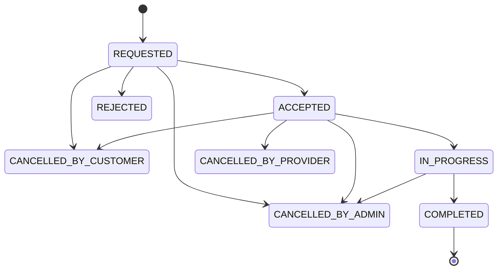

# Phase 3 - Functional Specification Document (FSD)

Product: GharTak  
Stage: MVP  
Approved inputs: BRD and PRD  
Primary principle: build only what is required to validate first 100 users and first 50 completed bookings.

## 1. Module Breakdown

| Module | Purpose | Users |
|---|---|---|
| Authentication and Authorization | Registration, login, JWT, role access | Customer, Provider, Admin |
| Customer Module | Search, provider view, bookings, reviews | Customer |
| Provider Module | Profile, availability, booking response | Provider |
| Admin Module | Verification, categories, bookings, reviews | Admin |
| Category Module | Service category management | Admin, Customer |
| Provider Discovery Module | Search/filter verified providers | Customer |
| Booking Module | Booking lifecycle | Customer, Provider, Admin |
| Payment Tracking Module | Cash on Service tracking | Customer, Provider, Admin |
| Review Module | Ratings and moderation | Customer, Admin |
| Notification Module | In-app notifications and optional email | All |
| File Upload Module | Provider verification documents | Provider, Admin |

Post-MVP modules:

- Online payments.
- Real-time chat.
- Advanced analytics.
- Native mobile apps.
- Provider wallet.
- Automated matching.
- Multi-city support.

## 2. Customer Flows

### 2.1 Registration

1. Customer opens app.
2. Customer selects sign up.
3. Customer enters name, email/phone, password.
4. System validates input.
5. System creates customer account.
6. System logs customer in and issues JWT.

Rules:

- Phone or email must be unique.
- Password must be hashed.
- Customer role is assigned automatically.
- Customer does not need admin approval.

### 2.2 Search and Browse

1. Customer views active categories.
2. Customer selects category.
3. Customer optionally filters by locality.
4. System displays verified active providers only.
5. Customer opens provider profile.

Rules:

- Unverified providers must never appear publicly.
- Disabled categories must not appear.
- Search works by category and locality.

### 2.3 Booking Creation

Customer provides:

- Service category.
- Provider.
- Address.
- Locality.
- Preferred date/time.
- Issue description.
- Optional alternate phone.

Rules:

- Customer must be logged in.
- Provider must be verified and active.
- Preferred date/time cannot be in the past.
- Payment mode defaults to CASH_ON_SERVICE.
- Booking starts as REQUESTED.

### 2.4 Booking Tracking and Cancellation

Customer can view:

- Booking status.
- Provider details.
- Category.
- Address.
- Preferred date/time.
- Payment mode.

Customer can cancel only when status is REQUESTED or ACCEPTED.

Customer cannot cancel once status is IN_PROGRESS or COMPLETED.

### 2.5 Review

1. Booking reaches COMPLETED.
2. Customer submits rating from 1 to 5 and optional comment.
3. System stores review.
4. System recalculates provider average rating.
5. Review appears unless hidden by admin.

Rules:

- One review per booking.
- Only booking customer can review.
- Reviews are allowed only for completed bookings.

## 3. Service Provider Flows

### 3.1 Provider Registration

Provider enters:

- Name.
- Email/phone.
- Password.
- Service categories.
- Localities served.
- Experience.
- Basic price note.
- Address.
- Optional document upload.

Provider status defaults to PENDING_VERIFICATION.

### 3.2 Verification

1. Admin opens pending providers.
2. Admin reviews submitted details.
3. Admin optionally calls provider manually.
4. Admin approves or rejects.

If approved:

- Provider status becomes VERIFIED.
- Provider becomes searchable.
- Provider can receive bookings.

If rejected:

- Provider remains hidden.

### 3.3 Profile and Availability

Provider can update:

- Bio.
- Experience.
- Categories.
- Localities served.
- Availability.
- Price note.

Admin-only fields:

- Verification status.
- Disabled status.
- Documents.
- Rating.

### 3.4 Booking Flow

1. Provider logs in.
2. Provider sees booking requests.
3. Provider accepts or rejects.
4. Accepted booking moves to ACCEPTED.
5. Provider marks IN_PROGRESS.
6. Provider marks COMPLETED.

Rules:

- Provider can update only assigned/requested bookings.
- Provider cannot edit customer address.
- Provider cannot delete bookings.

## 4. Admin Flows

Admin can:

- Log in securely.
- Manage categories.
- Approve/reject providers.
- Disable/re-enable providers.
- View all bookings.
- Update booking statuses.
- Add internal notes.
- Hide/restore reviews.
- View dashboard metrics.

Admin accounts are created through seed script or direct database setup during MVP.

## 5. Booking Lifecycle

### States

| State | Description |
|---|---|
| REQUESTED | Customer created booking |
| ACCEPTED | Provider accepted |
| REJECTED | Provider rejected |
| IN_PROGRESS | Provider started service |
| COMPLETED | Service completed |
| CANCELLED_BY_CUSTOMER | Customer cancelled |
| CANCELLED_BY_PROVIDER | Provider cancelled |
| CANCELLED_BY_ADMIN | Admin cancelled |
| EXPIRED | Provider did not respond, Nice to Have |

### Allowed Transitions

| From | To | Actor |
|---|---|---|
| REQUESTED | ACCEPTED | Provider |
| REQUESTED | REJECTED | Provider |
| REQUESTED | CANCELLED_BY_CUSTOMER | Customer |
| REQUESTED | CANCELLED_BY_ADMIN | Admin |
| ACCEPTED | IN_PROGRESS | Provider |
| ACCEPTED | CANCELLED_BY_CUSTOMER | Customer |
| ACCEPTED | CANCELLED_BY_PROVIDER | Provider |
| ACCEPTED | CANCELLED_BY_ADMIN | Admin |
| IN_PROGRESS | COMPLETED | Provider/Admin |
| IN_PROGRESS | CANCELLED_BY_ADMIN | Admin |



## 6. Payment Lifecycle

MVP payment mode: CASH_ON_SERVICE.

Payment states:

- NOT_APPLICABLE_YET.
- CASH_PENDING.
- PAID_CASH.
- DISPUTED.

Flow:

1. Booking created with CASH_ON_SERVICE.
2. Service completed.
3. Provider optionally records final amount.
4. Customer pays provider directly.
5. Payment status becomes PAID_CASH.

No online gateway is included in MVP.

## 7. Review Lifecycle

Review states:

- VISIBLE.
- HIDDEN_BY_ADMIN.
- FLAGGED, Nice to Have.

Hidden reviews do not appear publicly and should not count toward public average rating.

## 8. API Requirements

Base prefix: `/api/v1`

### Auth

| Method | Endpoint | Access |
|---|---|---|
| POST | `/auth/register/customer` | Public |
| POST | `/auth/register/provider` | Public |
| POST | `/auth/login` | Public |
| GET | `/auth/me` | Authenticated |

### Categories

| Method | Endpoint | Access |
|---|---|---|
| GET | `/categories` | Public/Auth |
| POST | `/admin/categories` | Admin |
| PATCH | `/admin/categories/{id}` | Admin |
| PATCH | `/admin/categories/{id}/status` | Admin |

### Providers

| Method | Endpoint | Access |
|---|---|---|
| GET | `/providers` | Public/Customer |
| GET | `/providers/{id}` | Public/Customer |
| GET | `/provider/me` | Provider |
| PATCH | `/provider/me` | Provider |
| PATCH | `/provider/me/availability` | Provider |
| GET | `/admin/providers` | Admin |
| PATCH | `/admin/providers/{id}/approve` | Admin |
| PATCH | `/admin/providers/{id}/reject` | Admin |
| PATCH | `/admin/providers/{id}/disable` | Admin |

### Bookings

| Method | Endpoint | Access |
|---|---|---|
| POST | `/bookings` | Customer |
| GET | `/bookings/my` | Customer |
| GET | `/bookings/{id}` | Owner/Admin |
| PATCH | `/bookings/{id}/cancel` | Customer |
| GET | `/provider/bookings` | Provider |
| PATCH | `/provider/bookings/{id}/accept` | Provider |
| PATCH | `/provider/bookings/{id}/reject` | Provider |
| PATCH | `/provider/bookings/{id}/start` | Provider |
| PATCH | `/provider/bookings/{id}/complete` | Provider |
| GET | `/admin/bookings` | Admin |
| PATCH | `/admin/bookings/{id}/status` | Admin |

### Reviews

| Method | Endpoint | Access |
|---|---|---|
| POST | `/bookings/{id}/review` | Customer |
| GET | `/providers/{id}/reviews` | Public/Auth |
| GET | `/admin/reviews` | Admin |
| PATCH | `/admin/reviews/{id}/hide` | Admin |
| PATCH | `/admin/reviews/{id}/restore` | Admin |

## 9. Database Requirements

Core tables:

- `users`
- `customer_profiles`
- `provider_profiles`
- `categories`
- `provider_categories`
- `provider_localities`
- `bookings`
- `booking_status_history`
- `payments`
- `reviews`
- `provider_documents`
- `admin_notes`
- `notifications`

Rules:

- `users.email` unique when present.
- `users.phone` unique when present.
- One provider profile per provider user.
- One customer profile per customer user.
- One review per booking.
- Public provider search filters by active user, verified provider, public status, category, and locality.

## 10. Error Handling

Standard API error:

```json
{
  "error": {
    "code": "BOOKING_INVALID_STATUS",
    "message": "Booking cannot be cancelled after service has started.",
    "details": {}
  }
}
```

Common codes:

- VALIDATION_ERROR
- AUTH_REQUIRED
- INVALID_CREDENTIALS
- FORBIDDEN
- NOT_FOUND
- DUPLICATE_ACCOUNT
- PROVIDER_NOT_VERIFIED
- BOOKING_INVALID_STATUS
- REVIEW_NOT_ALLOWED
- CATEGORY_INACTIVE
- ACCOUNT_DISABLED
- SERVER_ERROR

## 11. Edge Cases

| Case | Handling |
|---|---|
| Customer books inactive provider | Block |
| Customer enters past time | Validation error |
| Customer reviews twice | Block duplicate |
| Provider is not verified | Hide publicly |
| Provider updates another provider's booking | Forbidden |
| Admin disables category with active bookings | Existing bookings continue, new bookings blocked |
| Admin disables provider with active bookings | Warn admin; manual resolution |
| Provider does not respond | Admin/customer can cancel |

## 12. Notifications

MVP channels:

- In-app notifications.
- Optional email through free SMTP.
- Manual phone/WhatsApp outside the system.

Post-MVP:

- SMS.
- Official WhatsApp API.

Events:

- Provider registration submitted.
- Provider approved/rejected.
- Booking created.
- Booking accepted/rejected.
- Booking cancelled.
- Booking completed.
- Review submitted.

Notifications must not block booking actions.

## 13. Security Requirements

- JWT access tokens.
- Secure password hashing with bcrypt or Argon2.
- Backend-enforced role-based access.
- Admin accounts not publicly creatable.
- Provider documents private.
- Do not expose full customer address until booking is accepted or assigned.
- Do not log passwords or JWT tokens.
- Validate request bodies.
- Restrict file uploads.
- Use CORS allowlist.
- Disable debug mode in production.

## 14. Approval Status

Approved by product owner. Proceeded to Phase 4 User Stories.
