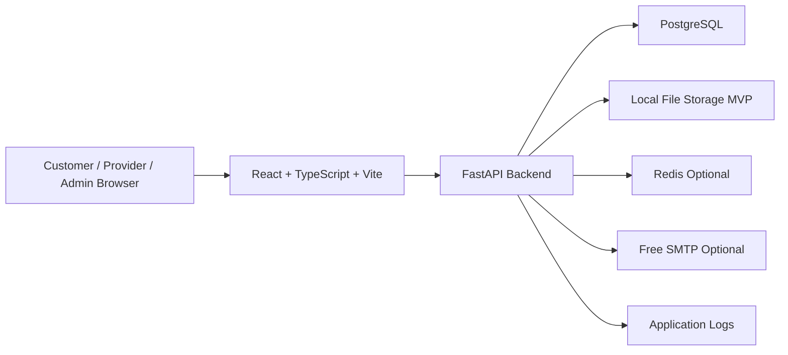
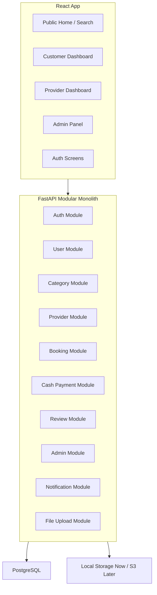
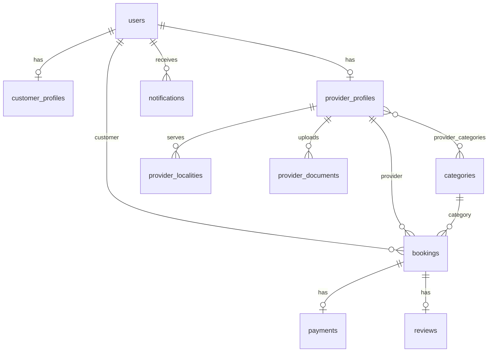
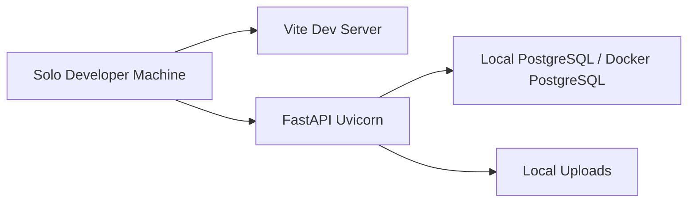

# Phase 5 - System Design

Product display name: GharTak  
Architecture principle: production-grade modular monolith, built for MVP validation and minimal paid migration later.  
Current constraint: zero-cost development.  
Future constraint: when SMS, deployment, managed databases, file storage, email, or payments become paid subscriptions, migration should require minimal code changes.

## 1. High-Level Architecture



Decision: use a modular monolith.

Reasons:

- Fastest for solo development.
- Easy to test and deploy.
- Avoids microservice overhead.
- Enough for first 100 users.
- Can still keep clear domain boundaries.

## 2. Component Diagram



## 3. Internal Service Design

These are internal modules, not separate deployable services.

| Service | Responsibility | MVP |
|---|---|---|
| AuthService | Register, login, password hashing, JWT | Yes |
| UserService | Shared user lifecycle and status | Yes |
| CategoryService | Service categories | Yes |
| ProviderService | Profile, verification, availability | Yes |
| BookingService | Booking creation and transitions | Yes |
| PaymentService | Cash payment tracking | Yes |
| ReviewService | Ratings and moderation | Yes |
| AdminService | Dashboard and admin actions | Yes |
| NotificationService | In-app and optional email/SMS adapters | Yes |
| FileStorageService | Local/S3-compatible upload handling | Yes |
| SearchService | Provider filtering | Yes |
| CacheService | Redis abstraction | Post-MVP unless needed |

## 4. Database Schema



Tables:

| Table | Key Fields |
|---|---|
| `users` | `id`, `name`, `email`, `phone`, `password_hash`, `role`, `is_active`, timestamps |
| `customer_profiles` | `id`, `user_id`, `default_address`, `default_locality` |
| `provider_profiles` | `id`, `user_id`, `bio`, `experience_years`, `verification_status`, `availability_status`, `price_note`, `average_rating`, `total_reviews`, `is_public` |
| `categories` | `id`, `name`, `slug`, `description`, `icon`, `is_active`, `display_order` |
| `provider_categories` | `provider_id`, `category_id` |
| `provider_localities` | `id`, `provider_id`, `locality` |
| `bookings` | `id`, `customer_id`, `provider_id`, `category_id`, `address`, `locality`, `preferred_datetime`, `issue_description`, `status`, `payment_mode`, `final_amount` |
| `booking_status_history` | `id`, `booking_id`, `from_status`, `to_status`, `actor_user_id`, `note`, timestamp |
| `payments` | `id`, `booking_id`, `payment_mode`, `payment_status`, `amount`, `paid_at` |
| `reviews` | `id`, `booking_id`, `customer_id`, `provider_id`, `rating`, `comment`, `status` |
| `provider_documents` | `id`, `provider_id`, `file_name`, `file_path`, `file_type`, `uploaded_at` |
| `notifications` | `id`, `user_id`, `type`, `title`, `message`, `is_read`, `created_at` |
| `admin_notes` | `id`, `entity_type`, `entity_id`, `admin_id`, `note`, `created_at` |

## 5. API Design

Base path: `/api/v1`

### Public/Auth

| Method | Endpoint |
|---|---|
| POST | `/auth/register/customer` |
| POST | `/auth/register/provider` |
| POST | `/auth/login` |
| GET | `/categories` |
| GET | `/providers` |
| GET | `/providers/{provider_id}` |

### Customer

| Method | Endpoint |
|---|---|
| GET | `/me` |
| POST | `/bookings` |
| GET | `/bookings/my` |
| GET | `/bookings/{booking_id}` |
| PATCH | `/bookings/{booking_id}/cancel` |
| POST | `/bookings/{booking_id}/review` |

### Provider

| Method | Endpoint |
|---|---|
| GET | `/provider/me` |
| PATCH | `/provider/me` |
| PATCH | `/provider/me/availability` |
| GET | `/provider/bookings` |
| PATCH | `/provider/bookings/{booking_id}/accept` |
| PATCH | `/provider/bookings/{booking_id}/reject` |
| PATCH | `/provider/bookings/{booking_id}/start` |
| PATCH | `/provider/bookings/{booking_id}/complete` |

### Admin

| Method | Endpoint |
|---|---|
| GET | `/admin/dashboard/summary` |
| POST | `/admin/categories` |
| PATCH | `/admin/categories/{category_id}` |
| GET | `/admin/providers` |
| PATCH | `/admin/providers/{provider_id}/approve` |
| PATCH | `/admin/providers/{provider_id}/reject` |
| PATCH | `/admin/providers/{provider_id}/disable` |
| GET | `/admin/bookings` |
| PATCH | `/admin/bookings/{booking_id}/status` |
| PATCH | `/admin/reviews/{review_id}/hide` |

## 6. Authentication Strategy

- JWT access tokens.
- Password hashing with bcrypt or Argon2.
- JWT contains `user_id`, `role`, and expiry.
- Admin account created through seed script.
- Public registration supports customer and provider only.

Post-MVP:

- Refresh tokens.
- OTP/SMS login.
- OAuth/social login if useful.

## 7. Authorization Strategy

Backend-enforced role-based access:

| Role | Access |
|---|---|
| Customer | Own profile, provider discovery, own bookings, own reviews |
| Provider | Own profile, own assigned/requested bookings |
| Admin | Categories, providers, bookings, reviews, dashboard |

Rules:

- Frontend role checks are UX only.
- Backend enforces permissions on every endpoint.
- Providers cannot access other providers' bookings.
- Customers cannot access other customers' bookings.
- Only verified providers appear publicly.

## 8. File Storage Design

MVP: local filesystem.

Example:

```text
uploads/
  provider-documents/
    {provider_id}/
      id-proof.jpg
```

Rules:

- Store metadata in PostgreSQL.
- Restrict file size.
- Allow JPG, PNG, PDF only.
- Provider documents are private.
- Serve documents through authenticated endpoints only.

Paid-ready path:

- Use `FileStorageService` interface.
- `LocalFileStorageService` now.
- `S3FileStorageService` later.
- Business logic should not depend on storage vendor SDKs.

## 9. Search Design

MVP search uses PostgreSQL queries.

Filters:

- Category.
- Locality.
- Verification status.
- Availability.
- Optional rating sort.

Do not use Elasticsearch in MVP.

Paid-ready path:

- Add search ranking or external search later behind `SearchService`.

## 10. Deployment Architecture

MVP local development:



Recommended local stack:

- Frontend: React + Vite.
- Backend: FastAPI + Uvicorn.
- Database: PostgreSQL via Docker or local install.
- Migrations: Alembic.
- Tests: Pytest and frontend smoke tests.

Free deployment:

- Static frontend hosting if available.
- Free backend hosting if available.
- Free PostgreSQL tier if available.
- Local filesystem only if host has persistent storage.

Paid-ready path:

- Managed PostgreSQL via `DATABASE_URL`.
- Paid app hosting via environment config.
- S3-compatible storage through storage adapter.
- SMS provider through notification adapter.

## 11. Monitoring Strategy

MVP:

- `/api/v1/health` endpoint.
- Structured logs.
- Admin dashboard counts.
- Manual uptime checks.

Health response:

```json
{
  "status": "ok",
  "database": "ok"
}
```

Post-MVP:

- Error tracking.
- Uptime monitoring.
- Metrics dashboards.

## 12. Logging Strategy

Log:

- Login failures.
- Registrations.
- Provider approval/rejection.
- Booking state changes.
- Review moderation.
- Unexpected server errors.

Do not log:

- Passwords.
- JWT tokens.
- Full identity documents.
- Sensitive personal data beyond required IDs.

Example:

```json
{
  "event": "booking_status_changed",
  "booking_id": "123",
  "actor_user_id": "45",
  "from_status": "REQUESTED",
  "to_status": "ACCEPTED"
}
```

## 13. Zero-Cost Now, Paid-Ready Later

From day one, infrastructure integrations must be behind narrow interfaces:

| Concern | MVP Implementation | Paid-Ready Replacement |
|---|---|---|
| Database | Local/Docker PostgreSQL | Managed PostgreSQL |
| File storage | Local filesystem | AWS S3 or compatible storage |
| Notifications | In-app, optional free SMTP | SMS provider, paid email |
| Payments | Cash on Service | Razorpay/UPI/card gateway |
| Cache | No cache or local dev Redis | Managed Redis |
| Deployment | Local/free hosting | Paid cloud/app platform |
| Maps | Optional OpenStreetMap | Paid maps only if needed |

Design rule:

Business logic calls application services such as `NotificationService`, `PaymentService`, and `FileStorageService`, never vendor SDKs directly.

## 14. Tech Stack

| Layer | Choice | Reason |
|---|---|---|
| Frontend | React + TypeScript + Vite | Fast, modern, free |
| Backend | FastAPI | Productive and typed |
| Database | PostgreSQL | Reliable relational model |
| ORM | SQLAlchemy | Mature Python ecosystem |
| Migrations | Alembic | Standard migration tooling |
| Auth | JWT | Simple MVP auth |
| Cache | Redis optional | Add only when needed |
| Storage | Local now, S3 later | Zero cost with migration path |
| Maps | OpenStreetMap if needed | Free |
| Notifications | In-app first | Avoid SMS cost |

## 15. Approval Status

Approved by product owner. Proceeded to Phase 6 Implementation Planning.
